# Student: Adrián Arenilla Seco
## Microsoft AZ-204 - Build serverless, full stack applications in Azure

In this exercise, we will learn how to create, compile, and deploy modern full-stack applications in Azure with the language of your choice (Python, Node.js, or .NET) and with a Vue.js interface. Topics covered include modern database, CI / CD, and DevOps capabilities, backend API development, REST, and more. Using a real-world scenario of trying to take the bus, you will learn how to create a solution that uses Azure SQL Database, Azure Functions, Azure Static Web Apps, Logic Apps, Visual Studio Code, and GitHub Actions.

### [Go to the learning path (Instructions) -->](https://docs.microsoft.com/es-es/learn/paths/build-serverless-full-stack-apps-azure)
### [Go to YouTube tutorial -->](https://youtu.be/XBxBC959tLg)

## Working Architecture

Create Azure SQL Database and SQL Server.

Create a new connection with Azure Data Studio.

Check that the connection is correct.
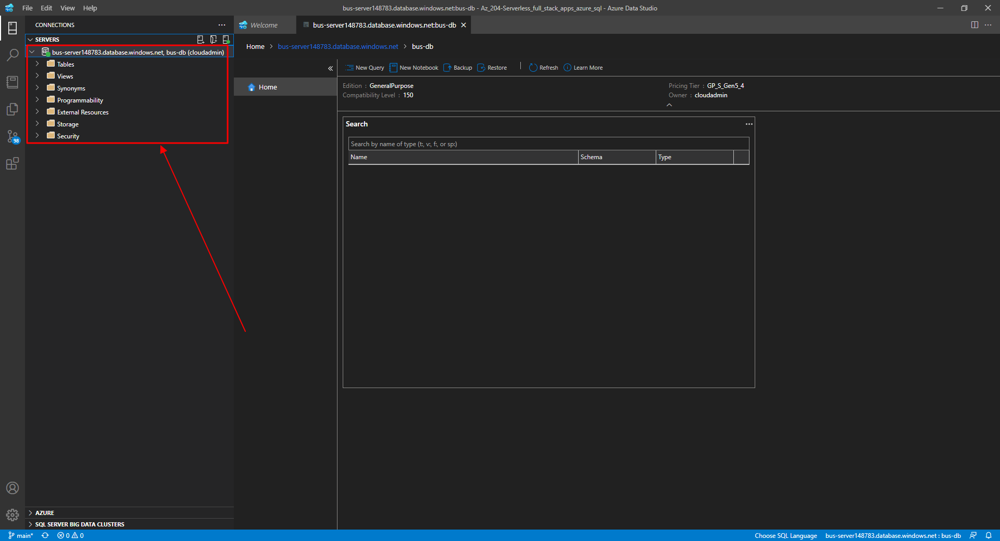

Connect to Azure SQL Database with Visual Studio Code.

Set up the database's schema with T-SQL.

Set up the database's schema with T-SQL.

Set up the database's schema with T-SQL.

Process bus data with Azure SQL Database.

Process bus data with Azure SQL Database.

Process bus data with Azure SQL Database.
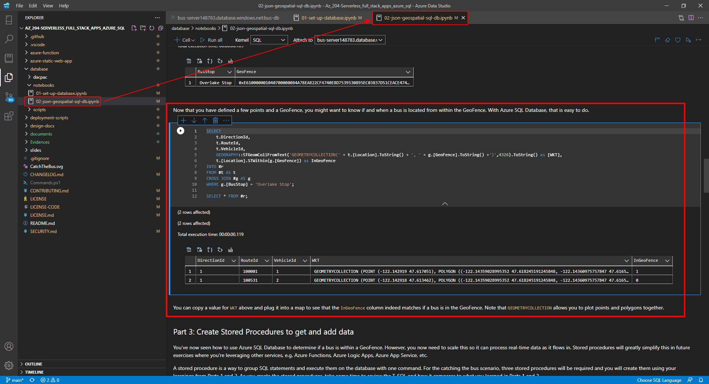

Verify that the geofence has been inserted correctly.
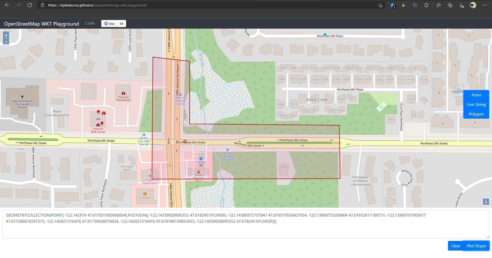

Verify that the geofence has been inserted correctly.
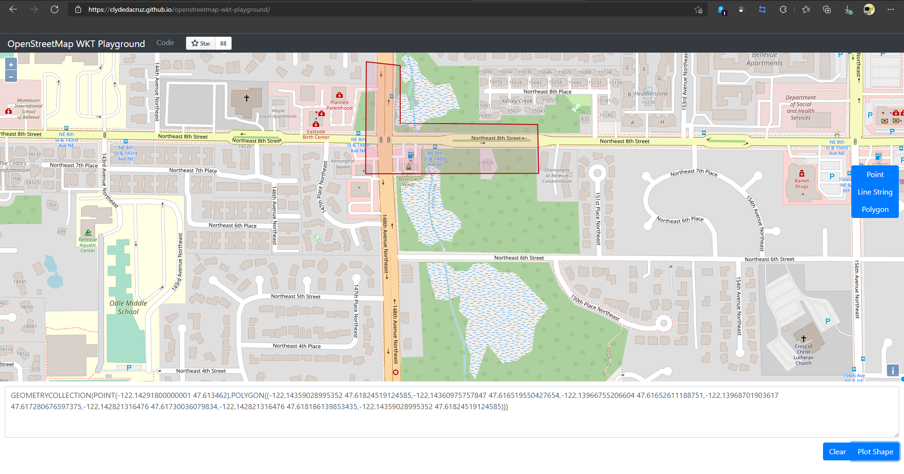

Process bus data with Azure SQL Database.
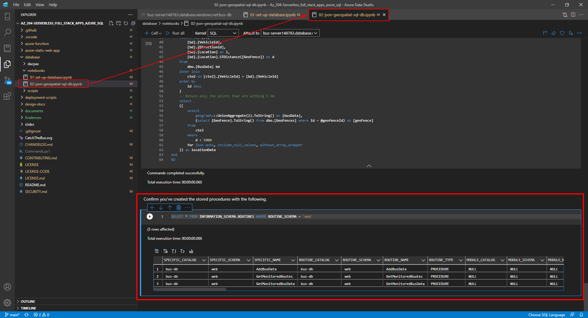

Configure secrets securely with GitHub.
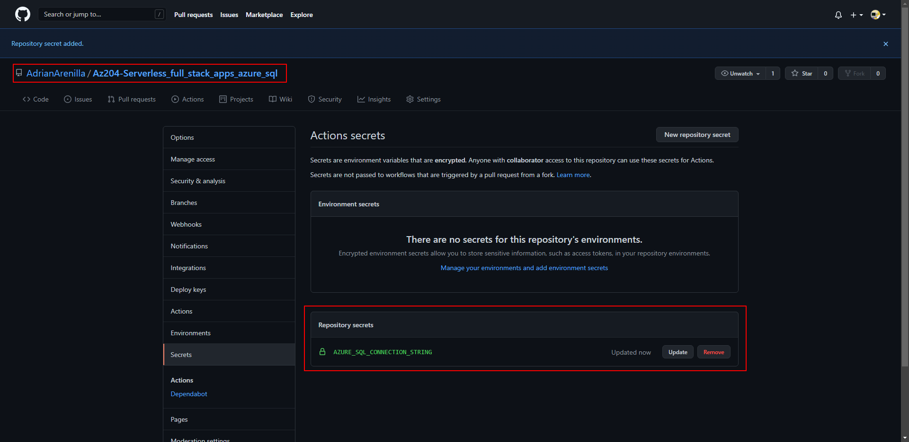

Configure yaml file for GitHub Actions.

Observe the contents of the workflow that is running (or has completed).

In sqlcmd copy and paste the script to import the flat path data file and verify that everything is correct.
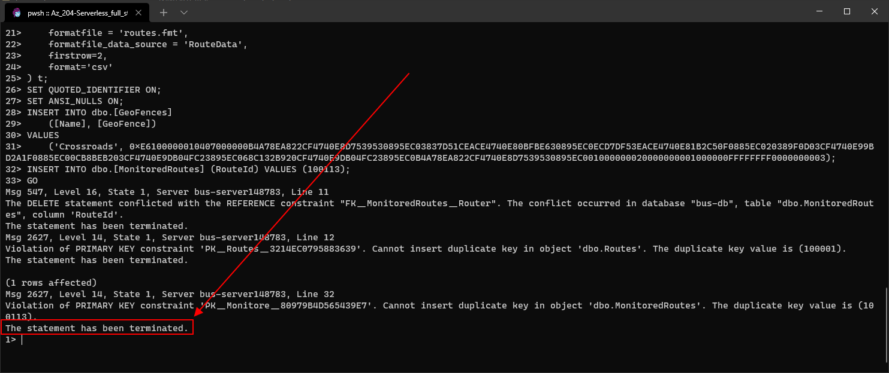

Create Storage Account and Function App.

Locally run and debug Azure Functions.

Run 'func start' to start the function.

Create three App Service Config.
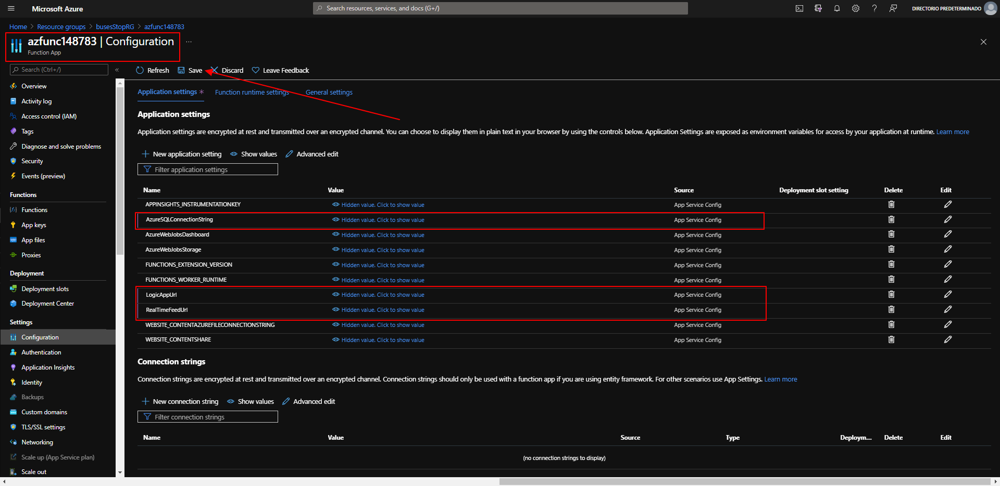

Configure secrets securely with GitHub.
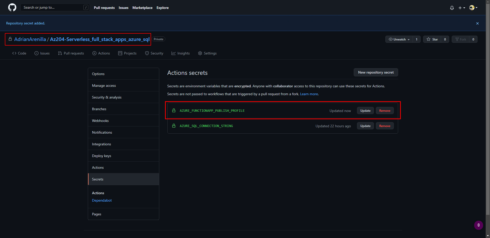

Observe the contents of the workflow that is running (or has completed).

Monitor results in the Azure portal.
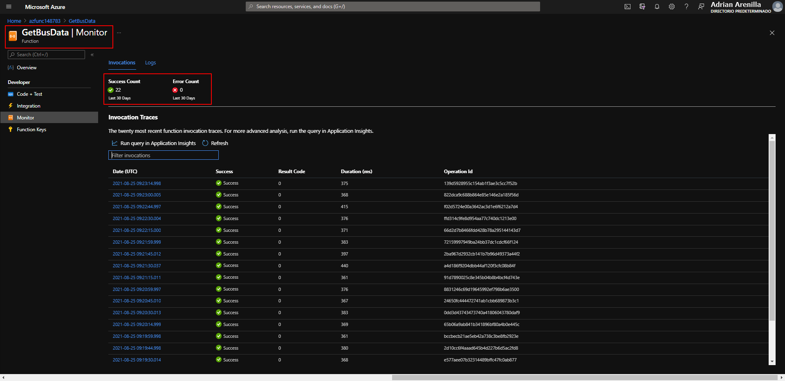

Monitor results in the Azure portal.
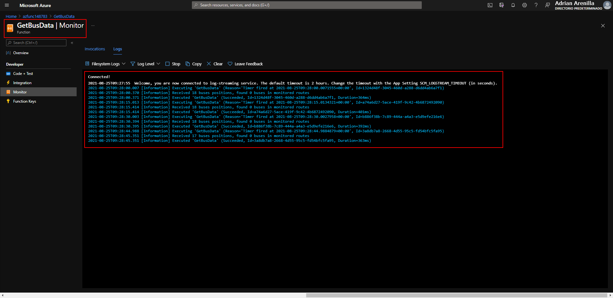

Create the Azure Logic App and Outlook connector.

Update App Service Config. (LogicAppUrl).
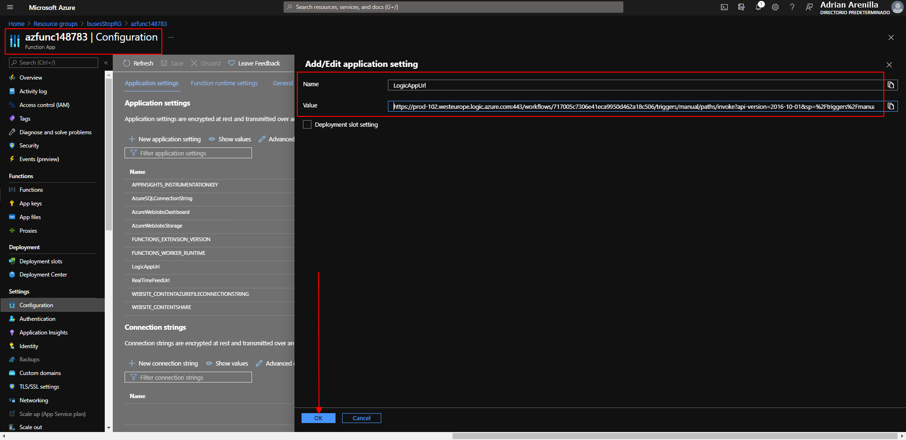

Create an Azure Static Web App using the Azure portal.

Configure application settings for Azure Static Web Apps.
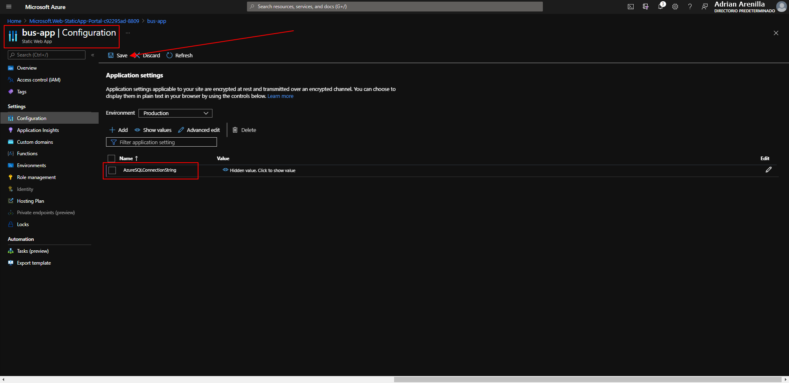

Review deployment run history with GitHub Actions.
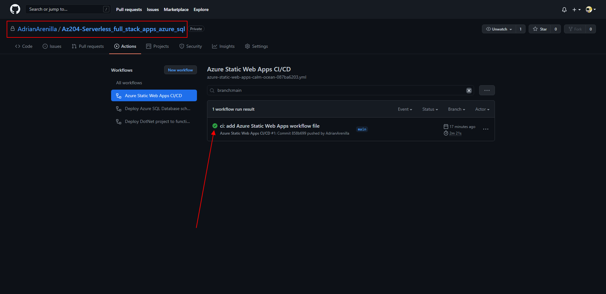

All resources used to create the application.
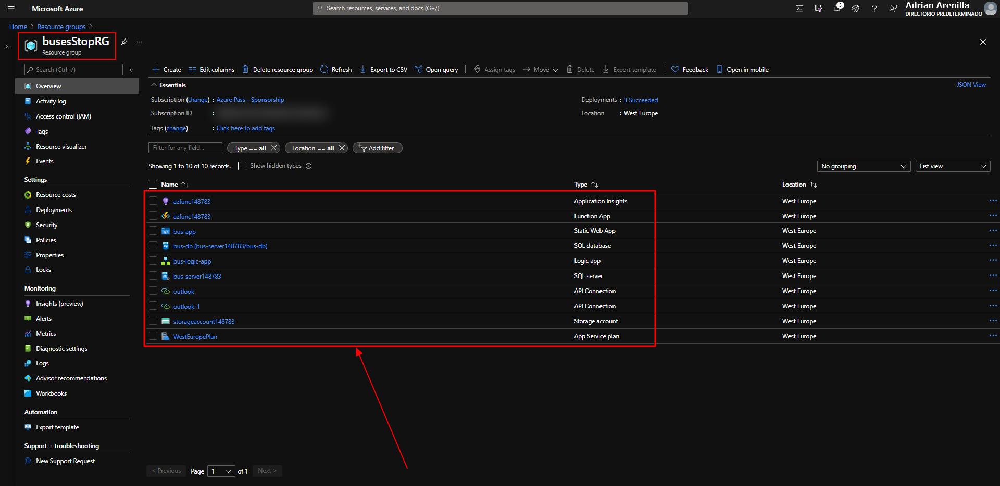

Confirmation e-mail (Exiting the Geofence).

Confirmation e-mail (Entering the Geofence).

Updated map with Geofence and buses.

Updated map with Geofence and buses.

